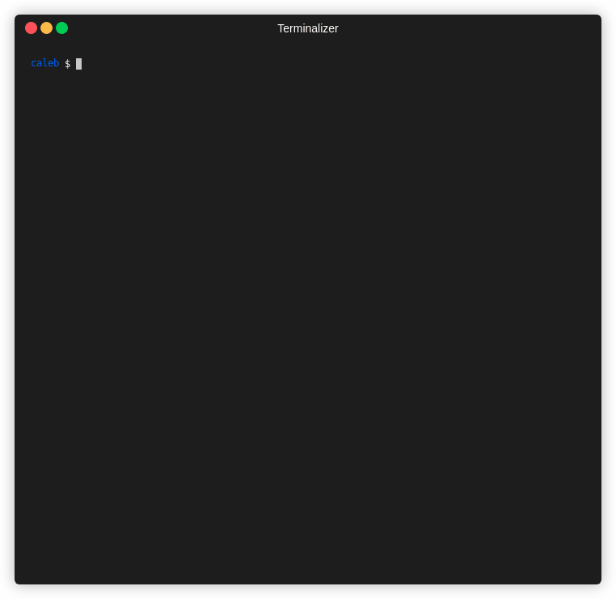

# .ls

Hate those pesky config files in your project root directory? Try this!

## What

`.ls` automatically hides the dot files in your `ls` output, and stashes them in a nice little `.config` directory!

## Why

[I guess some people think this is a problem that needs to be solved.](https://news.ycombinator.com/item?id=24066748)
